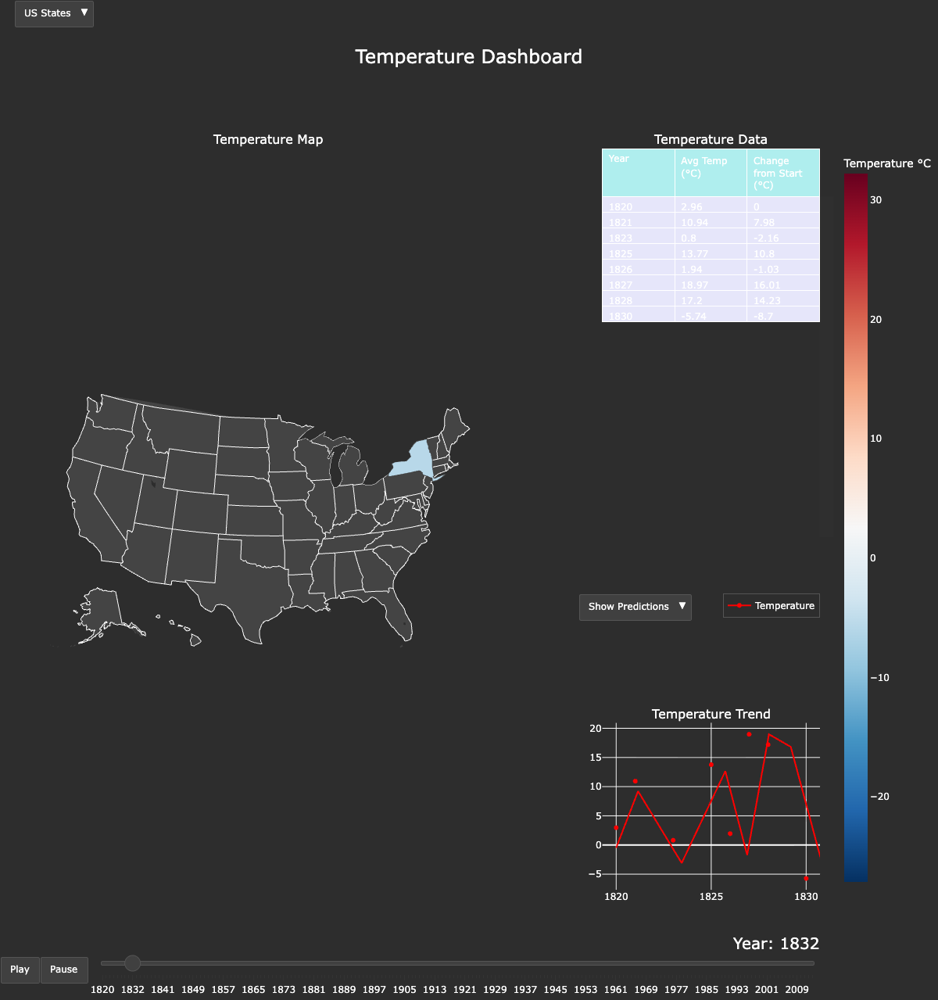

# ESTVP — Earth Surface Temperature Visualization Project

Interactive temperature analysis dashboard built for CSC 422 (Automated Learning & Data Analysis) at NC State University, Fall 2024.



## Overview

ESTVP processes decades of historical meteorological data and presents it through an animated, interactive dashboard. Users can explore temperature trends at both US state and global country levels, with linear regression predictions projected 10 years forward.

## Features

- **Animated Choropleth Maps** — US state-level and global country-level temperature heatmaps with year-by-year animation
- **Dynamic Predictions** — Linear regression model generates 10-year forward projections that update as the timeline progresses
- **Interactive Controls** — Play/pause animation, year slider, view switching (US/Global), and togglable prediction overlay
- **Data Pipeline** — Preprocessing with Pandas and NumPy including cleaning, outlier detection (Z-score, IQR, Isolation Forest, KNN), and threshold-based trimming

## Tech Stack

- **Python** — Pandas, NumPy, scikit-learn, Plotly, Dash, SciPy
- **Visualization** — Plotly choropleth maps, subplots, animated frames
- **ML** — scikit-learn LinearRegression for trend prediction; Isolation Forest and Local Outlier Factor for data cleaning

## Project Structure

```
├── app.py                   # Main entry point (refactored)
├── src/
│   ├── config.py            # Paths, constants, theme settings
│   ├── data.py              # Data loading, cleaning, transformations
│   └── visualization.py     # Dashboard figure construction
├── Combined.py              # Original monolithic dashboard (preserved)
├── dataHandler.py           # Outlier detection pipeline (Dash UI)
├── FinalPrototype/          # Dash-based interactive prototype
├── Prototype2/              # Earlier Flask-based prototype
├── Noise.py                 # Noise analysis and visualization
├── archive/                 # Temperature datasets
│   └── Trimmed/Threshold/   # Cleaned datasets used by dashboard
├── assets/                  # CSS and screenshots
├── Documents/               # Project proposal and midterm report
└── requirements.txt
```

## Usage

```bash
python -m venv .venv
source .venv/bin/activate
pip install -r requirements.txt
python app.py
```

The dashboard will be generated as an HTML file and opened in your default browser.

## Data

This project uses the [Climate Change: Earth Surface Temperature Data](https://www.kaggle.com/datasets/berkeleyearth/climate-change-earth-surface-temperature-data) dataset from Kaggle. Raw CSV files are not included in this repository due to size (~600MB). The trimmed/processed datasets used by the dashboard are included.
